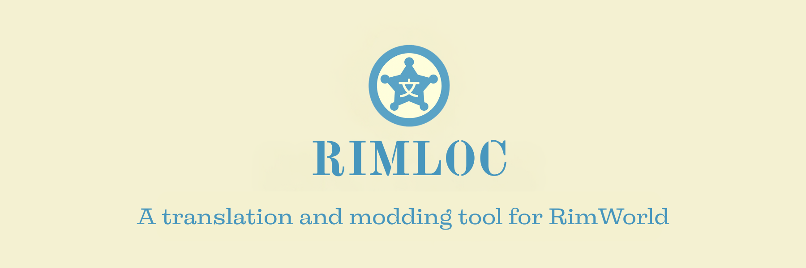

# RimLoc

<p align="center">
  
 </p>

[English](README.md) | [Русский](docs/readme/ru/README.md)

[](https://github.com/0-danielviktorovich-0/RimLoc/actions/workflows/build.yml) [](https://crates.io/crates/rimloc-cli) [](https://0-danielviktorovich-0.github.io/RimLoc/) [](LICENSE) [](docs/en/community/support.md) [](https://buymeacoffee.com/danielviktorovich) [](https://ko-fi.com/danielviktorovich) [](https://discord.gg/g8w4fJ8b)

RimLoc is a Rust-based toolkit for RimWorld localization and mod translation management. It keeps translation sources, PO/CSV exports, and QA checks in one workflow on Linux, macOS, and Windows.

Quick links for newcomers:
- Start translating: docs/en/guide/translators.md
- Configuration (rimloc.toml): docs/en/guide/configuration.md

## Why RimLoc?

- Automates discovery of all `Keyed`/`DefInjected` strings in a mod and keeps them in sync.
- Catches duplicate keys, empty values, and placeholder mismatches before they ship.
- Converts between XML and translation-friendly PO/CSV formats for translators.
- Builds translation-only RimWorld mods directly from a curated `.po` file.
- Ships with an i18n-ready CLI (English & Russian) powered by Fluent.

## Five-minute Quick Start

```bash
cargo install rimloc-cli
git clone https://github.com/0-danielviktorovich-0/RimLoc.git
cd RimLoc
rimloc-cli scan --root ./test/TestMod --format json | jq '.[0]'
rimloc-cli validate --root ./test/TestMod
rimloc-cli export-po --root ./test/TestMod --out-po ./logs/TestMod.po --lang ru
rimloc-cli build-mod --po ./logs/TestMod.po --out-mod ./logs/TestMod-ru --lang ru --dry-run
```

1. Install the CLI from crates.io.
2. Use the bundled `test/TestMod` fixture (or your mod) as input.
3. `scan` lists translation units; pipe to `jq` to inspect structure.
4. `validate` highlights empty strings, duplicates, and placeholder errors with exit code 1 on failure.
5. `export-po` writes a single `.po` file that translators or CAT tools can work with.
6. `build-mod` previews the translation-only mod RimLoc would scaffold from that PO file.

Need to export for translators?

```bash
rimloc-cli export-po --root ./test/TestMod --out-po ./logs/TestMod.po --lang ru
```

Want to ship a standalone translation mod?

```bash
rimloc-cli build-mod --po ./logs/TestMod.po --out-mod ./logs/TestMod-ru --lang ru
```

## Essential CLI Commands

| Command | When to use | Example |
|---------|-------------|---------|
| `rimloc-cli scan` | Inventory strings from mod XML into CSV or JSON. | `rimloc-cli scan --root ./path/to/mod --format json --out-json ./logs/scan.json` |
| `rimloc-cli validate` | QA check XML for duplicates, empties, placeholders. | `rimloc-cli validate --root ./path/to/mod --format text` |
| `rimloc-cli validate-po` | Ensure PO translations retain placeholders. | `rimloc-cli validate-po --po ./translations/ru.po --strict` |
| `rimloc-cli export-po` | Generate a single PO hand-off file for translators. | `rimloc-cli export-po --root ./path/to/mod --out-po ./out/mymod.po --lang ru` |
| `rimloc-cli import-po` | Bring PO updates back into XML or a single `_Imported.xml`. | `rimloc-cli import-po --po ./out/mymod.po --mod-root ./path/to/mod --dry-run` |
| `rimloc-cli build-mod` | Scaffold a translation-only mod ready for release. | `rimloc-cli build-mod --po ./out/mymod.po --out-mod ./ReleaseMod --lang ru` |
| `rimloc-cli diff-xml` | Compare source vs translation presence; detect changed source with baseline PO. | `rimloc-cli diff-xml --root ./Mods/MyMod --source-lang en --lang ru --baseline-po ./prev.po --out-dir ./diff` |
| `rimloc-cli annotate` | Add/remove source-text comments in translation XML. | `rimloc-cli annotate --root ./Mods/MyMod --source-lang en --lang ru --backup` |
| `rimloc-cli xml-health` | Scan XML under `Languages/` for structural/read errors. | `rimloc-cli xml-health --root ./Mods/MyMod --format json --lang-dir Russian` |
| `rimloc-cli init` | Create translation skeleton under `Languages/<lang>` from source. | `rimloc-cli init --root ./Mods/MyMod --source-lang en --lang ru` |

### Morph providers (experimental)

- Online Morpher WS3: set `MORPHER_TOKEN`, then run:
  - `rimloc-cli morph --root ./Mods/MyMod --provider morpher --lang ru --limit 50`
- Local pymorphy2 service: start the helper under `scripts/pymorphy2_local/`, set `PYMORPHY_URL`:
  - `rimloc-cli morph --root ./Mods/MyMod --provider pymorphy2 --lang ru --limit 50`
  - Control via flags: `--timeout-ms`, `--cache-size`, `--pymorphy-url`

### Versioned mods

If your mod uses per-version subfolders (e.g., `1.4`, `1.5`, `v1.6`), you can target a specific version or include all:

```bash
# Scan a specific version folder (auto-detects latest if omitted)
rimloc-cli scan --root ./Mods/MyMod --game-version 1.4

# Validate all versions under the mod root
rimloc-cli validate --root ./Mods/MyMod --include-all-versions

# Export PO considering versioned layout
rimloc-cli export-po --root ./Mods/MyMod --out-po ./out/MyMod.po --game-version v1.6
```

<!-- Demo and screenshots will be added after the first public walkthrough is recorded. -->

## Documentation & Support

- Browse the full docs: [RimLoc Docs](https://0-danielviktorovich-0.github.io/RimLoc/)
- Desktop GUI (Tauri) quick start: docs/en/guide/gui.md
- Filing issues? See the short [Issue Guidelines](docs/en/community/issues.md) for what to include.
- Learn the format: [PO Files 101](docs/en/guide/po_files.md)
- Translate the CLI: [Localization Guide](docs/en/community/localization.md)
- Command reference lives under `docs/en/cli/` (with Russian mirrors in `docs/ru/cli/`).
- Sample fixtures for experimenting are under `test/`.
- Report issues or request features via [GitHub Issues](https://github.com/0-danielviktorovich-0/RimLoc/issues).

## Changelog

See [CHANGELOG.md](CHANGELOG.md) for notable changes and release history.

## Contributing

New to the project? Start with the contributor guide in [AGENTS.md](AGENTS.md) for workspace layout, tooling, and review expectations.

Want to update the docs? Run `mkdocs serve` from the repo root and edit the files under `docs/`—Russian and English stay in sync by mirroring structure.

---

## License

GNU GPL — see [LICENSE](LICENSE).
