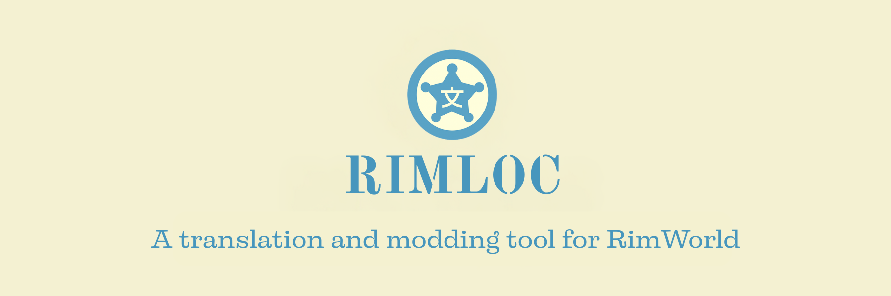
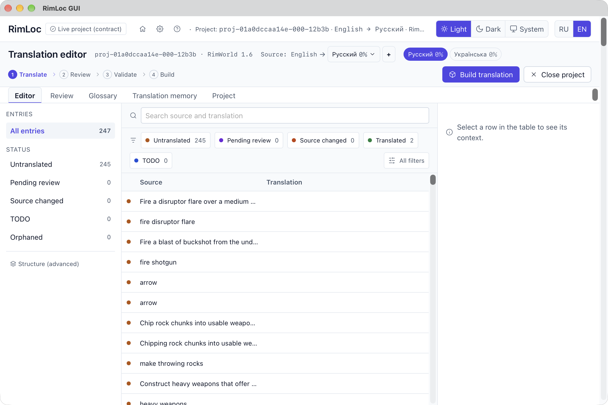
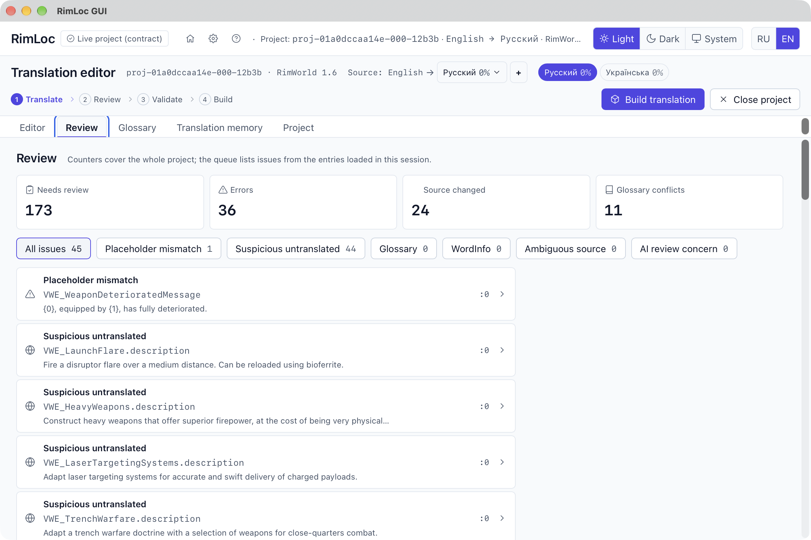
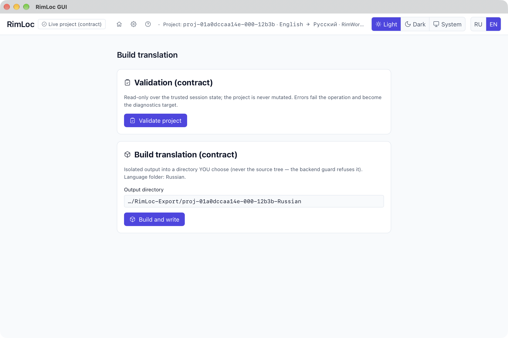
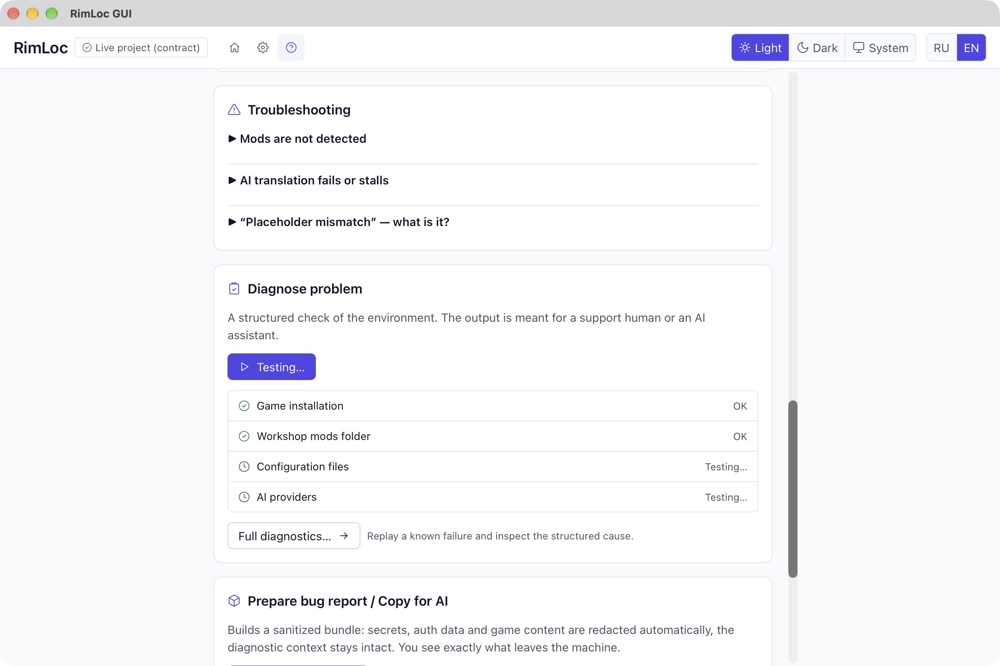

# RimLoc

<p align="center">
  
</p>

<p align="center">
<strong>Локальный тулкит для перевода модов RimWorld</strong> — от извлечения строк до готового мода-перевода, без обязательного облака.
</p>

<p align="center">
[](https://github.com/0-danielviktorovich-0/RimLoc/actions/workflows/ci.yml)
[](https://0-danielviktorovich-0.github.io/RimLoc/)
[](LICENSE)
[](docs/en/community/support.md)
[](https://buymeacoffee.com/danielviktorovich)
[](https://ko-fi.com/danielviktorovich)
</p>

**Статус: pre-beta (0.1.x), обновлено 2026-10-05.** Активно разрабатывается,
интерфейс и контракт ещё меняются. Что уже работает, а что нет — честно
расписано в [«Статус возможностей»](#статус-возможностей).

---

## Зачем

Перевод мода RimWorld — это сотни XML-строк в `Keyed` и `DefInjected`, которые
легко потерять, продублировать или перевести с устаревшим плейсхолдером. RimLoc
закрывает этот конвейер одним инструментом:

- находит все переводимые строки мода и следит за их актуальностью;
- ловит дубликаты, пустые значения и потерянные плейсхолдеры до релиза;
- отдаёт переводчику привычный `.po` (Poedit, любой CAT-редактор) и забирает
  его обратно в XML;
- собирает отдельный мод-перевод, который не трогает файлы оригинала.

**RimWorld-first.** Формат модов, версионные папки, `LoadFolders`, плейсхолдеры
игры — знания об этом зашиты в первичный адаптер. Мультиигровая архитектура
адаптеров заложена, но кроме RimWorld ничего не заявляется.

**Local-first.** Ядро работает полностью офлайн: проекты лежат файлами на вашем
диске, исходные папки модов читаются только для чтения, запись идёт лишь в
указанные вами выходные пути. Сетевые функции (морфологические и LLM-провайдеры)
опциональны.

## Что внутри

- **CLI** (`rimloc-cli`, Rust): scan · validate · export/import PO ·
  build-mod · diff · аннотации · health-check XML. Интерфейс CLI двуязычный
  (английский/русский).
- **Десктоп-GUI** (Tauri 2): проектная модель с персистентом и ревизиями,
  редактор с инспектором источника, живая валидация, глоссарий, сборка и
  экспорт, диагностика с санитизацией. Фронтенд — React 19; прежний Svelte-фронт
  заморожен и держится как fallback-сборка.
- **Документация**: [сайт на GitHub Pages](https://0-danielviktorovich-0.github.io/RimLoc/)
  (англ/рус), гайды, справочник команд, туториалы.

## Текущий workflow

1. **Скан** — инвентаризация строк мода (JSON/CSV), с учётом версионных папок.
2. **Валидация** — дубликаты, пустоты, плейсхолдеры; код выхода 1 при ошибках.
3. **Экспорт PO** — один файл для переводчика или CAT-инструмента.
4. **Перевод** — в Poedit или в редакторе GUI (исходник и перевод рядом,
   история ревизий, глоссарий).
5. **Импорт/сборка** — обратная сборка `.po` в XML или автономный
   мод-перевод; есть dry-run.
6. **Диагностика** — санитизированный support-bundle, когда что-то пошло не так.

## Статус возможностей

Уровни свидетельств: **5** — проверено e2e на живом приложении; **4** —
интеграционные тесты; **3** — юнит-тесты; **2** — подтверждено кодом;
**0** — не реализовано.

| Область | Состояние | Уровень |
| --- | --- | --- |
| Извлечение строк (DefInjected, Keyed) | работает в CLI и GUI | 5 |
| Валидация: пустоты, плейсхолдеры, дубликаты, дрейф источника | работает | 5 |
| Экспорт PO / POT / CSV / JSON / XLIFF / XML | работает | 5 |
| Импорт PO | работает | 5 |
| Импорт XLIFF | работает | 4 |
| Сборка мода-перевода с защитой путей вывода | работает | 5 |
| Редактор GUI: правка→сохранение→ревизии, инспектор источника | работает (React) | 5 |
| Глоссарий проекта | работает | 5 |
| Мультиязычность проекта (переключение целевого языка) | работает | 5 |
| Поддержка версионных папок модов (`1.4`…`v1.6`) | работает | 5 |
| Патчи (PatchOperations), C#-ключи, бэкстори | частично | 3–4 |
| Морфология (русский) и WordInfo | не реализовано в новом конвейере | 0–2 |
| LLM/машинный перевод | шаблоны провайдеров в UI, вызовы не подключены | 2 |
| TM: накопление, fuzzy-поиск, импорт | не реализовано | 0 |
| Автоматический и агентный ремонт переводов | не реализовано | 0 |
| Тест в запущенной игре (Runtime Bridge) | только лаборатория, не в проде | 7 (testlab) |
| Адаптеры других игр | архитектурная закладка | 0 |

Ограничения, о которых мы знаем и не прячем: графический интерфейс ещё не
прошёл человеческое a11y/визуальное ревью (автопробы — PASS), подписанных и
нотаризованных установщиков нет, сравнение производительности React- и
Svelte-сборок не проводилось.

## Поддерживаемые версии RimWorld

- Мод-раскладки с версионными подпапками (`1.4`, `1.5`, `v1.6` и похожие):
  поддерживаются, при скане без флага берётся самая свежая найденная.
- Мод-перевод по умолчанию собирается с `About.xml` на версию **1.5**
  (переопределяется флагом `--rw-version` и конфигом).
- GUI-проекты по умолчанию нацелены на **1.6**; целевая версия выбирается при
  создании проекта.

## Платформы

| Платформа | Состояние |
| --- | --- |
| macOS (Apple Silicon) | верифицировано — основная среда разработки и приёмки |
| Windows, Linux | код кроссплатформенный, юнит-тесты гоняются в CI на трёх ОС; GUI-сборки на этих ОС руками не проверялись |
| Подписанные / нотаризованные установщики | нет |

## Быстрый старт

Проверенный путь — собрать из исходников: опубликованная на crates.io версия
`0.1.0-alpha.1` сильно отстаёт от кода, а выложенные релизы — dev-сборки
pre-release.

```bash
# 1. Нужны Rust (https://rustup.rs) и git
git clone https://github.com/0-danielviktorovich-0/RimLoc.git
cd RimLoc

# 2. Собрать CLI
cargo build -p rimloc-cli

# 3. Прогнать конвейер на встроенном тестовом моде
cargo run -p rimloc-cli -- scan --root ./test/TestMod --format json
cargo run -p rimloc-cli -- validate --root ./test/TestMod
cargo run -p rimloc-cli -- export-po --root ./test/TestMod --out-po ./logs/TestMod.po --lang ru
cargo run -p rimloc-cli -- build-mod --po ./logs/TestMod.po --out-mod ./logs/TestMod-ru --lang ru --dry-run
```

Что вы увидите: список строк мода в JSON, вердикт валидации («Всё чисто» на
фикстуре), файл `TestMod.po` для переводчика и предпросмотр мода-перевода
(dry-run ничего не пишет). Уберите `--dry-run` — получите готовый мод.

Вместо `test/TestMod` подставьте свой мод: `rimloc-cli scan --root ./Mods/МойМод`.
Полный набор команд и флагов — в [документации](https://0-danielviktorovich-0.github.io/RimLoc/).

Сборка десктоп-GUI (Node.js 20+, Rust):

```bash
cd gui/tauri-app/src-tauri
cargo tauri build        # дефолтная конфигурация (Svelte-fallback)
cargo tauri build --config tauri.react.conf.json   # React-фронтенд
```

## Скриншоты

> **Development preview.** Ниже — текущая дефолтная сборка (замороженный
> Svelte-фронтенд). Новые скриншоты React-интерфейса появятся после
> визуального парити-гейта — заменять их заранее не будем.

<p align="center">
  
  
  
  
</p>

## Куда дальше (north-star, не обещание)

Ориентиры качества, под которые идёт разработка: контекст перевода уровня
Gridly, CAT-воркфлоу уровня Trados, комьюнити-процессы уровня Crowdin.
Архитектура канонических проектов и адаптеров закладывает фундамент для других
игр (Minecraft, Terraria, Paradox, Unity-тайтлы) — это направление на будущее,
никаких обязательств и дат по ним нет. Ближайшая инженерная работа: TM
(память переводов), подключение LLM-провайдеров, человеческое ревью
доступности.

## Документация и сообщество

- [Сайт документации](https://0-danielviktorovich-0.github.io/RimLoc/) —
  установка, гайды, справочник CLI (исходники в [`docs/`](docs/), MkDocs).
- [CONTRIBUTING.md](CONTRIBUTING.md) — как собрать, протестировать и прислать PR.
- [SECURITY.md](SECURITY.md) — как приватно сообщить об уязвимости.
- [CODE_OF_CONDUCT.md](CODE_OF_CONDUCT.md) и [SUPPORT.md](SUPPORT.md).
- Баги и идеи — [GitHub Issues](https://github.com/0-danielviktorovich-0/RimLoc/issues);
  история изменений — [CHANGELOG.md](CHANGELOG.md).

## Лицензия

GNU GPL v3 — см. [LICENSE](LICENSE).
